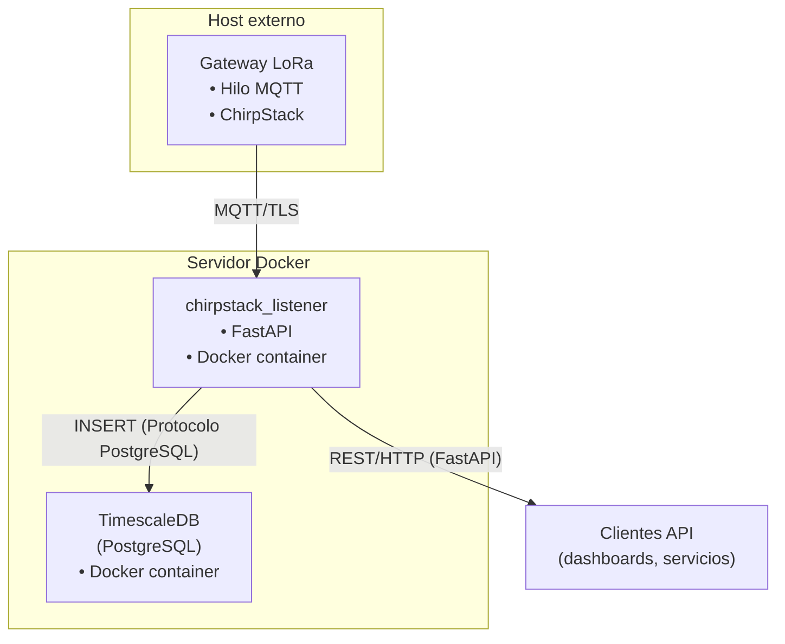

# ChirpStack Listener

Servicio **todo-en-uno** que se suscribe al broker MQTT de **ChirpStack**, almacena la telemetría *uplink* en **TimescaleDB** y la expone mediante **FastAPI**, todo orquestado con **Docker Compose** para entornos de producción.

---

## ✨ Características principales
* **Cliente MQTT con TLS** y reconexión exponencial  
* **TimescaleDB** para series temporales de alto rendimiento  
* **FastAPI** con acceso a datos
* Arquitectura definida en `docker-compose.production.yml`  
* **Supervisor** mantiene vivos API y cliente MQTT dentro del contenedor  

---

## 🗺️ Arquitectura de la pila



---

## 🚀 Inicio rápido

### 1 — Clonar y preparar
```bash
git clone https://github.com/juaquicar/jmq_chirpstack_listener.git
cd jmq_chirpstack_listener
cp env.production.example env.production         # Edita con tus credenciales
````

### 2 — Añadir certificados TLS dados por MQTT Listener

Coloca los ficheros en **`app/ctx/`** (o subcarpeta) con estos nombres:

```
app/ctx/
 ├─ ca.crt
 ├─ cert.crt
 └─ cert.key
```

Si cambias nombres o rutas, ajusta las variables `MQTT_CA`, `MQTT_CERT`, `MQTT_KEY` en `env.production`.

### 3 — Construir y lanzar

```bash
bash deploy.production.sh
```

El contenedor espera que la base de datos esté disponible (\~15 s) y luego arranca Gunicorn.

### 4 — Verificar

```bash
curl http://localhost:8999/health        # → {"status":"running"}
curl http://localhost:8999/mqtt_status   # {"connected":true,"last_rc":0,"last_ts":1746781843.7938542}
xdg-open http://localhost:8999/docs      # Swagger UI
```

---

## 🔧 Variables de entorno (principales)

| Variable                                   | Propósito                                                         |
| ------------------------------------------ | ----------------------------------------------------------------- |
| `DB_HOST`, `DB_USER`, `DB_PASS`, `DB_NAME` | Conexión a TimescaleDB                                            |
| `MQTT_BROKER`, `MQTT_PORT`                 | Dirección y puerto TLS del broker MQTT                            |
| `MQTT_TOPIC`                               | Tópico wildcard de ChirpStack (`application/+/device/+/event/up`) |
| `MQTT_CTX_DIR`                             | Carpeta de certificados dentro del contenedor (`/app/ctx`)        |
| `WORKERS`                                  | Número de *workers* de Gunicorn                                   |
| `HOST`, `PORT`                             | Dirección y puerto de la API dentro del contenedor                |

Añade o sobreescribe cualquier variable en **`env.production`**. Docker Compose las inyecta en ambos servicios.

---

## 🗄️ Persistencia

* **timescale\_data** — volumen con los datos de TimescaleDB
* **logs/** — *bind-mount* del host que recibe `/var/log/*.log` del contenedor

---

## 📜 Logs y depuración

```bash
# Transmisión en vivo de logs
docker compose -f docker-compose.production.yml logs -f chirpstack_listener_app

# Archivos individuales
tail -f logs/api.err.log      # FastAPI
tail -f logs/mqtt.err.log     # Cliente MQTT
```

---

## 🔁 Actualización continua

```bash
bash deploy.production.sh     # Compila de nuevo y reinicia sin pérdida de datos
```

Los datos persisten porque el volumen de TimescaleDB nunca se elimina.

```bash
user@ubuntu:~$ sudo ls /var/lib/docker/volumes
```

---

## 🧰 API de un vistazo

| Endpoint                                                                  | Descripción                                                 |
| ------------------------------------------------------------------------- | ----------------------------------------------------------- |
| `GET /health`                                                             | Prueba de vida del servicio                                 |
| `GET /mqtt_status`                                                        | Estado actual de la conexión MQTT                           |
| `GET /data?limit=N`                                                       | Devuelve las últimas *N* filas                              |
| `GET /measurements?device_id=&start=&end=`                                | Filtra mediciones de un dispositivo entre dos fechas        |
| `GET /latest_measurements?device_id=`                                     | Última medida de cada clave para un dispositivo             |
| `GET /latest_measurements_grouped?device_id=`                             | Última medida de cada clave (JSON agrupado por clave)       |
| `GET /latest_measurements_all/`                                           | Última medida de cada clave para **todos** los dispositivos |
| `GET /latest_measurements_all_grouped/`                                   | Última medida de cada clave, agrupado por dispositivo       |
| `GET /timeseries?device_id=&key=&start=&end=`                             | Serie temporal cruda de un sensor                           |
| `GET /timeseries/aggregated?device_id=&key=&start=&end=&interval=`        | Media por intervalo (`hour`/`day`/`week`)                   |
| `GET /timeseries/aggregated/full?device_id=&key=&start=&end=&interval=`   | Media, máximo y mínimo por intervalo                        |
| `GET /timeseries/aggregated/multi?device_ids=&key=&start=&end=&interval=` | Agregaciones (avg/max/min) para varios dispositivos         |


La documentación interactiva completa está disponible en `/docs` o `/redoc`.

---

## 🛡️ Notas de seguridad

* Utiliza **certificados TLS válidos** y mantén sus claves privadas seguras.
* Guarda `env.production` fuera del control de versiones.
* Expón únicamente el puerto `8999`; la conexión MQTT es saliente.

---

## 📄 Licencia

Distribuido bajo la licencia MIT. Consulta el archivo `LICENSE` para más detalles.

---

## 👤 Author

**Juanma Quijada**  
🔗 [GitHub](https://github.com/juaquicar)

---

> **¿Buscas la guía de desarrollo?**
> Visita **README-DEV.md** para instrucciones completas de desarrollo local.


